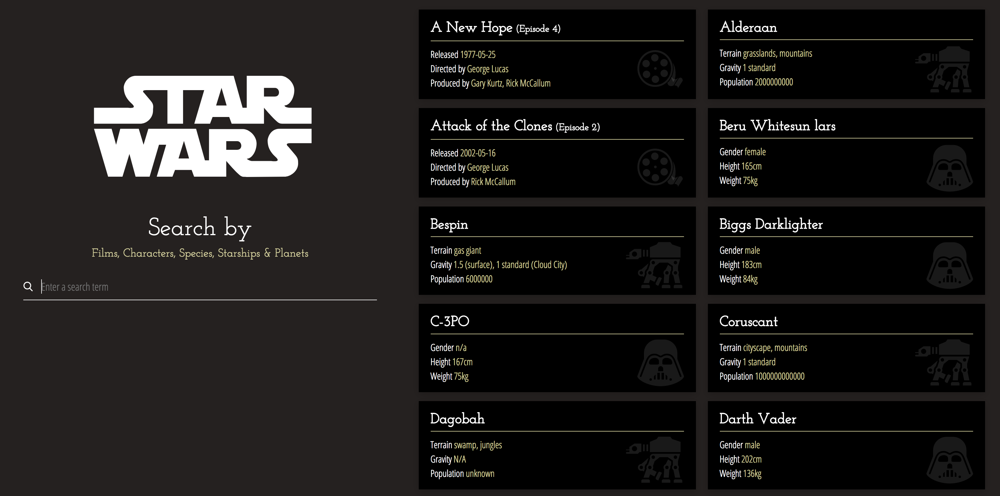

# SWAPI React Interface

Simple React interface for searching the [Star Wars API](https://swapi.co/).
Serves no real purpose, but is useful as an example or boilerplate for a React / Redux SPA using an API as a content source.

## Demo

[Click here](https://swapi.rbg.dev) for a demo.

## Dependencies

- Node / NPM
- Yarn - `npm install yarn -g`
- `yarn install` - to install project dependencies.

## Get Started

- `yarn start` - to start webpack dev server and watch for changes. Opens app in new browser window at [http://localhost:8080](http://localhost:8080).

## Other Commands

- `yarn build` - build production assets
